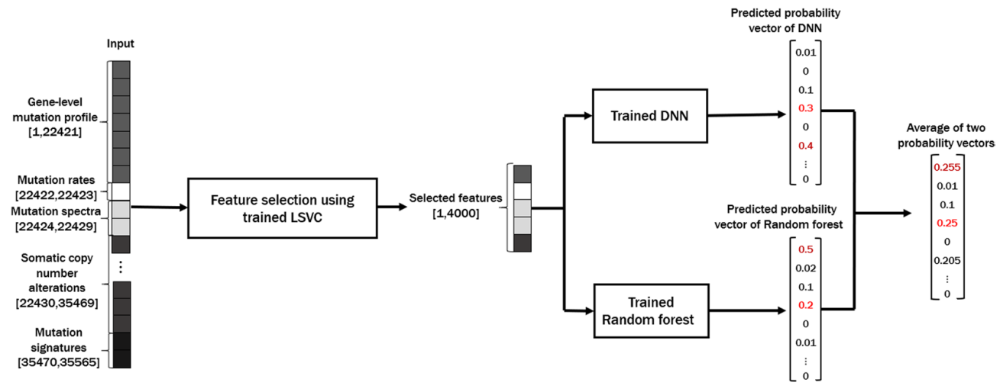

## CPEM
**CPEM: Accurate cancer type classification based on somatic alterations using an ensemble of a random foerest and a deep neural network**
The paper is available [here](https://www.nature.com/articles/s41598-019-53034-3)


## DATA
Data is avaliable on below address because of data size.
You can download the data and lable in here 
[Somatic alteration information](https://drive.google.com/file/d/1uDFNhzsodQky71bqykmJGcWnBfhO5_hp/view?usp=sharing)
, [Cancer type information](https://drive.google.com/file/d/1l2uggi6rfbNwarkR2fcAsOf2q5CLfbyu/view?usp=sharing)

## Quick start
----------------------------------
We recommend the below argument to use the similar verification method as this paper.
```sh
python main.py --epoch=120 --batch_size=16 --lr=1e-3 --inner=10 --outer=10 --ensemble --search --feature_selection
```

#inner: This argument can be 'LOOCV' (Leave One Out Cross Validation) or 'K' (K should be integer) for K-fold inner cross validation.
#outer: This argument can be 'LOOCV' (Leave One Out Cross Validation) or 'K' (K should be integer) for K-fold outer cross validation.
#ensemble: Whether you use ensemble model
#search: Whether you search the optimized number of features
#feature_selection: Whether you execute feature selection

## Requirements
1. tensorflow-gpu>=2.1.0 
2. scikit-learn>=0.18.1 
3. tensorflow-addons == 0.9.0 
4. hdf5sotrage

## Future work
To increase the performance of feature selection, we plan to modify the feature selection code to Tensorflow.

